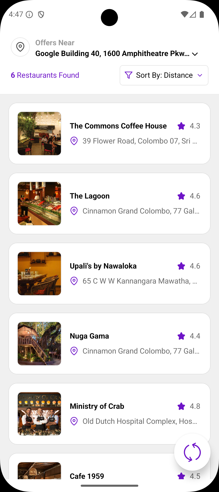
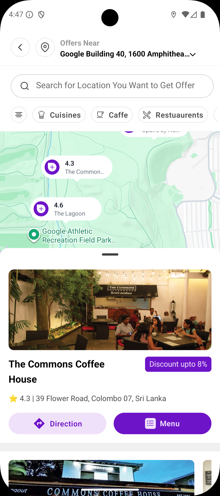
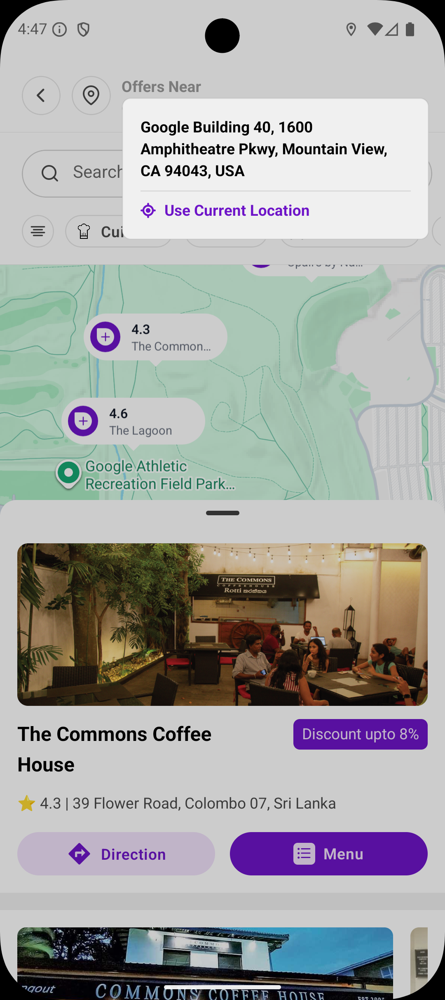

# 🍽️ Resto – Dynamic Restaurant Discovery App

**Resto** is a React Native mobile app for discovering restaurants, exploring locations on a map, and interacting with dynamic location-based content. It demonstrates geolocation handling, map integration, and mock restaurant data that updates based on the user’s location.

---

## 🌟 Key Features

* **Interactive Map Integration**
  Displays restaurants and the user’s current location using `react-native-maps`.

* **Real-Time Geolocation**
  Tracks the user’s location accurately and updates the map dynamically.

  * Location tracking is stopped automatically when leaving a screen to save battery and prevent background updates.

* **Dynamic Mocked Restaurant Data**

  * Restaurants on the **Restaurant Screen** are **mocked for demonstration purposes**.
  * Their coordinates are **relative to the current location**.
  * When the user changes location (via GPS or search), the restaurants **move accordingly**, simulating real-world dynamic behavior.

* **Custom UI Components**

  * Scrollable restaurant cards with ratings and images
  * Filters and sorting options for personalized experiences
  * Custom markers with optional shadows for better visualization

---

## 📸 Screenshots







---

## 💻 Installation

1. Clone the repository:

```bash
git clone https://github.com/YOUR_USERNAME/resto.git
cd resto
```

2. Install dependencies:

```bash
npm install
cd ios && pod install && cd ..
```

3. Run the app:

```bash
# Android
npx react-native run-android

# iOS
npx react-native run-ios
```

---

## 🗺 Restaurant Data Behavior

> **Important:**
>
> * Restaurants are **mocked for demonstration purposes**.
> * Their coordinates are **adjusted based on the current location**.
> * Changing the location (via GPS or search) **moves the restaurants dynamically**, simulating real-world location updates.
> * This allows testing map markers and location-based UI without a live backend.

---

## ⚡ Notes

* MapView must render **after the region is set** to prevent blank or frozen maps.
* Optimized for smooth location updates and dynamic map rendering.

---

## 📦 Dependencies

* `react-native-maps`
* `@react-native-community/geolocation`
* `react-native-google-places-autocomplete`

---

## 📝 Summary

**Resto** is a **location-aware restaurant discovery app**. Restaurants are mocked but dynamically update according to the user’s location. The app efficiently handles geolocation and map rendering, providing a realistic, interactive experience and a solid foundation for production-ready location-based apps.
